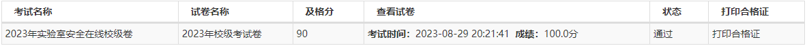
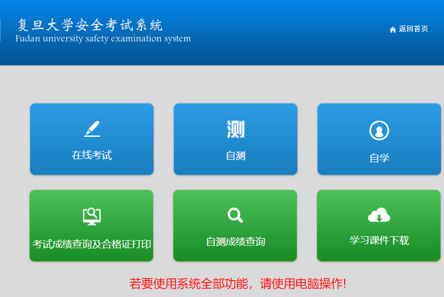
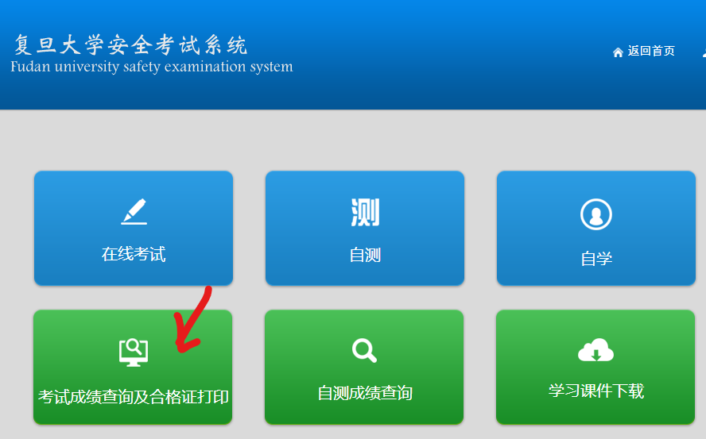
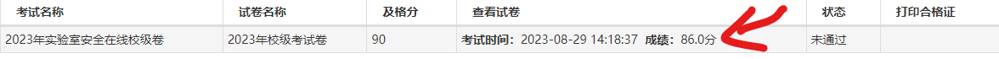
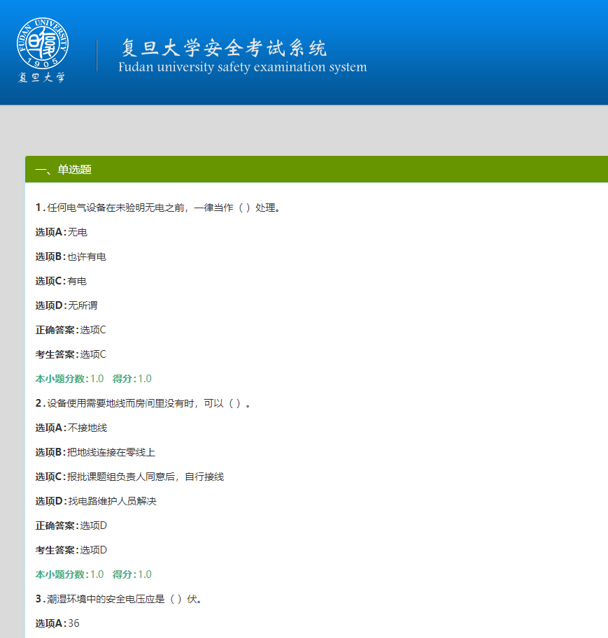

# SafeTest

本项目为复旦大学安全考试系统自动答题脚本，旨在帮助大家度过一个更加轻松的开学季。

## 成果

本项目的目标是尽可能地操作方便，以让更多的同学能够使用。

由于每次安全考试的题目是相同的，所以只需要获得一次题目，
就能获得满分，如果未来因为题库更新的原因正确率下降，
可以自行利用`load_question.py`来获得本次的题库。


## 环境配置

### selenium

可以自行去网上搜索下载方案
其中下载selenium时请使用

```text
pip install selenium==3.14.0
```

### 其他依赖

```text
selenium==3.14.0
fuzzywuzzy
python-Levenshtein
json
os
time
typing
```

### 环境变量

（如果不需要优化本项目，仅仅想要使用的同学可以跳过这一部分）
本项目的环境变量在`environment.py`中

```python
driver_path = "your/webdriver/path"
# default
main_page = "https://lsem.fudan.edu.cn/fd_aqks_new/examProgress/examBase/examIndex"
auth_url = "https://uis.fudan.edu.cn/authserver/login"

dataset_path = "./asset/dataset/index.html"
cookie_path = "./asset/cookie.txt"
question_path = "./asset/questions.json"

if_load_cookie = False

input_wait_time = 20
```

- driver_path: 填入你的webdriver的路径。
- auth_url: 复旦验证服务器的url。
- main_page: 测试界面的url，测试界面如下图所示。
  
- dataset_path: 暂时没用上
- cookie_path: 保存cookie的位置（不上传到github）
- question_path: 保存题库的位置（上传）
- if_load_cookie: 是否每次启动要加载一次cookie（为True则要重新加载）
    - 默认情况如果加载过cookie，则之后启动不再需要cookie
    - 当你很久未使用本项目（cookie失效），要么删除cookie.txt，要么将这个变量设置为True
- input_wait_time: 输入密码的时间(s)

## 运行

首先，先将`environment_template`改名为`environment`，
并修改相关参数值。

在项目文件夹打开terminal，输入以下命令

```text
python main.py
```

**登录以获得Cookie**

在这个界面你默认将会有20s的时间来输入你的账号密码，由于本项目只会获得cookie，只要你不把你的cookie传到网上，则没有安全问题


接下来就不需要你操作了，脚本会自动执行。

### 扩充题库

为了应对未来更新题库的可能，本项目提供扩充题库功能。

此时，应先删除项目的`./asset/questions.json`，并在安全考试系统中提交一次试卷（为了获得题目和答案）

那么你应该在以下地方可以看到题库：




如果能够显示此页面，那么就可以运行以下脚本，来更新题库了。
```text
python load_question.py
```

更新题库完毕，就可以按照上面的方法来自动答题了。